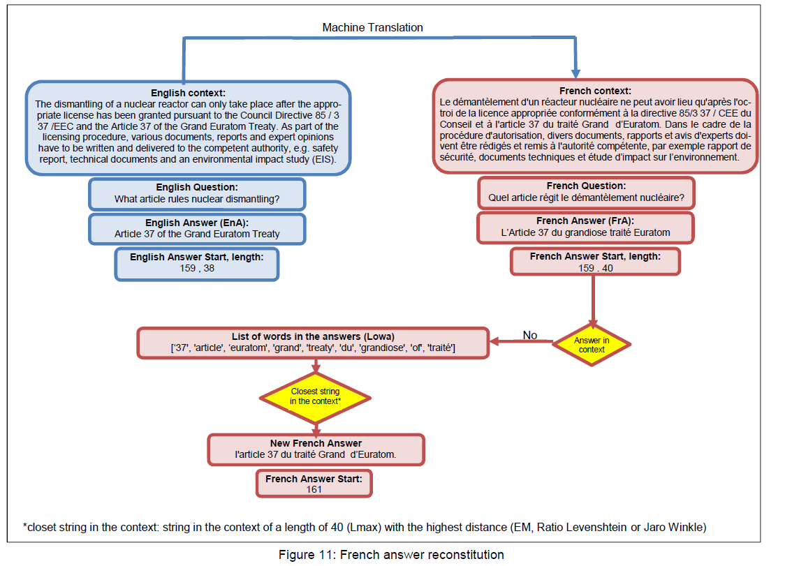

# French-SQuAD : French Machine Reading for Question Answering

# SQuAD v1.1 dataset in French

You will find in this repository a SQuAD v1.1 dev dataset in French. Since the train file is too big you can download it from :
https://drive.google.com/drive/folders/1HzvQv4W7sveWkuxbw04tTfgiDq0ZKW8U?usp=sharing

# How the dataset is build?

Almost all the models available are trained on English datasets. For our work we need to train with a French dataset.
Since we did not find any substantial French Q&A Dataset, we had to build one. Instead of starting from scratch and
spend weeks to ask crowd workers to read article, create questions and report answers and their start and end
position in the context, we preferred to translate the SQuAD training and dev datasets v1.1 (Rajpurkar et al., 2016)
from English to French.

SQuAD contains 107.7K query-answer pairs, with 87.5K for training, 10.1K for validation, and another 10.1K for
testing. Only the training and validation data are publicly available. Each training example of SQuAD is a triple of (d;
q; a) in which document d is a multi-sentence paragraph, q is the question and a is the answer to the question.
For Machine Translation, we utilized the publicly available Google Translate API GoogleTrans package provided by
SuHun Han on https://github.com/ssut/py-googletrans.

However, translating (d; q; a) from English to French is not enough. All the models need the answer span and its
position in the context, its start and end. Therefore, we need to find for the French answer the star and the end of the
answer in the French context.

Since the translation of the context and the answer are not always aligned, it is not always possible to find the answer
as translated in the context. In our translation less than 2/3 of the answers were found in the context. For the rest we
had to reconstitute the answer from the English one (EnA) and the French translated one (FrA).
For this reconstituted French answer, we first split the strings (EnA) and (FrA) in a list of words (Lowa) and try to find
the string in the context with a length equal to the maximum of (EnA) and (FrA) length, Lmax, and the maximum of
word close to the words in (Lowa). We used three kind of methods to determine how close two words are.
· Exact match = 1
· Ratio Levenshtein distance
· Jaro Winkler distance

For each string of a length of Lmax in the context, we add up the words distances and take the string with the highest
score. We did that with the strings including stop words and punctuation and strings without them (Non-normalized
and Normalized).
*closet string in the context: string in the context of a length of 40 (Lmax) with the highest distance (EM, Ratio Levenshtein or Jaro Winkle)

For more detail please see the paper : https://www.linkedin.com/pulse/something-new-french-text-mining-information-chatbot-largest-kabbadj/

# Abstract of the paper

The paper proposes to unlock the main barrier to machine reading and comprehension French natural language texts. This open the way to machine to find to a question a precise answer buried in the mass of unstructured French texts. Or to create a universal French chatbot. Deep learning has produced extremely promising results for various tasks in natural language understanding particularly topic classification, sentiment analysis, question answering, and language translation. But to be effective Deep Learning methods need very large training datasets. Until now these
technics cannot be actually used for French texts Question Answering (Q&A) applications since there was not a large Q&A training dataset. We produced a large (100 000+) French training Dataset for Q&A by translating and adapting the English SQuAD v1.1 Dataset, a GloVe French word and character embedding vectors from Wikipedia French Dump. We trained and evaluated of three different Q&A neural network architectures in French and carried out a French Q&A models with F1 score around 70%.

